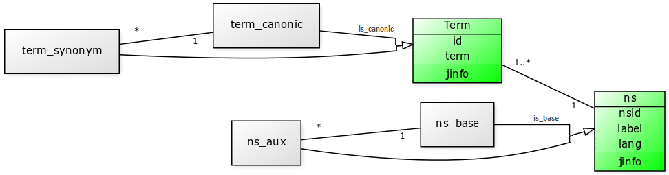

A simple terminological storage for PostgreSQL (old Sql-term project), adapted for "geographic" terms like street names.

----

This project offers a simple database for terminological storage, and illustrates the use of [PostgreSQL textsearch-dictionaries](http://www.postgresql.org/docs/9.1/static/textsearch-dictionaries.html), [dict-xsyn](http://www.postgresql.org/docs/current/static/dict-xsyn.html), [metaphone and levenshtein](http://www.postgresql.org/docs/current/static/fuzzystrmatch.html), in a context of terminological applications (search and admin).  Is supposed that, when all logic is at the (SQL) database, the algorithms can be simpler and faster.

It is under construction; thanks initial contributions of:
* `create extension metaphoneptbr` after install [AddressForAll/metaphone-ptbr](https://github.com/AddressForAll/metaphone-ptbr)
* Software SQL, "mode 1"  https://github.com/ppKrauss/sql-term
* Dataset of country codes https://github.com/datasets/country-codes
* Dataset of Brazilian states and regions http://datasets.ok.org.br/state-codes 
* Dataset of Brazilian cities http://datasets.ok.org.br/city-codes
 
## Objetive ##

To present *reference database structure* for "terminology by demand", and offer [requirements](https://en.wikipedia.org/wiki/Software_requirements_specification) and implementation of a *framework* for manage, search and resolve controlled terminologies. Also, as secondary aim, to illustrate a full-SQL implementation.

## Fast Guide

Use of SQL functions, or microservices with same *method name* (SEARCH, FIND, N2C, N2Ns, etc.). For function details and description, see [struct.sql](src/sql_mode1/step2_struct.sql), or examples [basic1](https://github.com/ppKrauss/sql-term/blob/master/examples/set-1-SQL/basic1.sql) (b1) and [basic2](https://github.com/ppKrauss/sql-term/blob/master/examples/set-1-SQL/basic2.sql) (b2).


* Main functions (run with JSON parameters, minimal are `qs` and `ns`):

      * `n2c()`: normal to canonic, retrieves the canonic term from a valid term of a namespace. See b1.
      * `n2ns()`: normal to normals, retrieves the all synonyms of a valid term (of a namespace). See b1.
      * `search_tab()`: search by terms with specified option, returning nearst (similar) terms. See b2.
      * `search2c()`: as `search_tab()` but reducing the set to canonical terms. See b2.
      * `find()`: complete algorithm to "best search choice".
      * `find2c()`: as `find()` but reducing to the set to canonical terms. See b3. [Compare with ElasticSearch at Wayta](https://github.com/ppKrauss/sql-term/wiki/Comparing-with-ElasticSearch).
* Utilities:
      * `term1.basemask()` see b1.
      * `nsget_nsopt2int()` see b2.

* `term_lib`, main functions:

    * `term_lib.normalizeterm()`: see b1.
    * `term_lib.score()`: see b1.
    * `term_lib.score_pairs()`: see b1.

Standard JSON parameters:

* `qs`: query string
* `ns`: namespace or mask
* ...

## Modeling ##

The *Term* table is so simple: each term, canonic or not, is a row in the main table. A secondary table for namespaces, *ns*, split terms in "base" group (theme, corpus or project) and  its "auxiliary" groups, for translations (one namespace for each language) and other dependent namespaces.

UML class diagram of *SCHEMA TermStore*, implemented as tables and views, at [Mode1 structure](src/sql_mode1/step2_struct.sql):



### Conventions ###
See [sql_](sql) folder.

The  main public *methods*, the term-resolvers (*N2C* and *N2Ns*) and "search engines" (*search* and *find*), runs with a defined  namespace, or with a set of namespaces that points to the same base-namespace.

For each namespace the "canonic term" notion can change, from standardized to "most-popular" statistics. Semantic conflict or compromise between canonic term and its synonymous, are both valid; semantic analyses is out of scope of this project. The `is_cult` flag is an option to point that a term is expressed in the "cult form" (valid by dictionary), or not. The `is_suspect` flag  to flag "suspected as invalid" terms, with informed "suspect cause" stored in its JSON `jinfo`. Any other original information can be stored at `jinfo`, but only the standard JSON fields will be retrieved in the framework functions.

## PREPARE ##
```
git clone http://git.AddressForAll.org/geoterm.git
cd geoterm
#nano src/conf.json
sh src/make.sh
```
